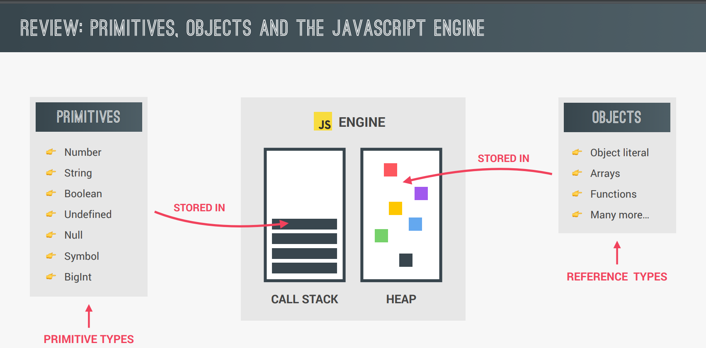
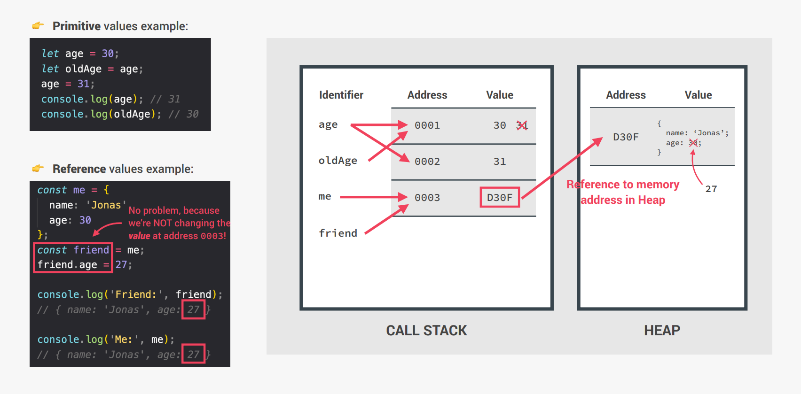

# Primitives vs Objects [udemy](https://www.udemy.com/course/the-complete-javascript-course/learn/lecture/22648509?start=75#questions)

**_Primitive vs Objects in pdf file starts from line 114_**

### For Primitive

```js
let age = 30;
let oldAge = age;
age = 31;

console.log(age, oldAge); // as expected 31,30
```

### for object

```js
const me = {
  name: 'Nasim',
  age: 25,
};

const updateMe = me;
console.log(me, updateMe); // as expected

updateMe.age = 26;

// now look at the output again
console.log(me, updateMe); // me object's age value is also 26
```

Here note this.First i copy the me object and store it to updateme then i have change a property of updateMe but the updated property of is also influenced the me object

**_Why it is?_**



- when we talking about memory and memory management it's usual to call primitive to primitive type and objects `Reference` types
- now as we know js engine made of call stack and heap. heap is the place where objects stores. all the objects or reference type are store in `HEAP`
- And Primitive stored in call stack or execution context



```js
// Reference types
const jessica = {
  firstName: 'Jessica',
  lastName: 'Williams',
  age: 27,
};
const marriedJessica = jessica;
marriedJessica.lastName = 'Davis';
console.log('Before marriage:', jessica);
console.log('After marriage: ', marriedJessica);
// marriedJessica = {}; // this will not work
```
