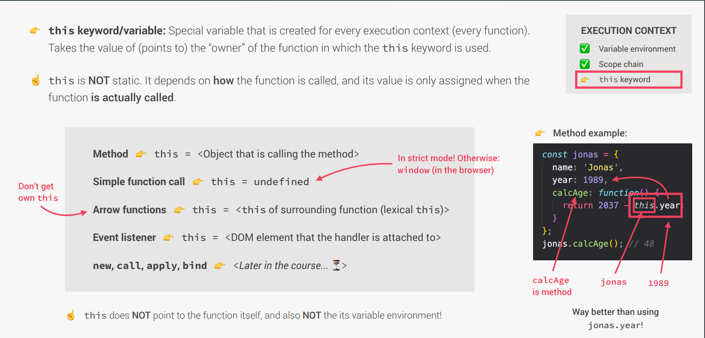

# this Keyword [udemy](https://www.udemy.com/course/the-complete-javascript-course/learn/lecture/22648501#questions)

**_this keyword in pdf file starts from line 111_**



## outside function

```js
console.log(this); // refers to window
```

### Method

```js
// method

const jonas = {
  name: 'Jonas',
  year: 1989,
  calcAge: function () {
    return 2037 - this.year; // here this point to jonas beacuse jonas call the function
  },
};
jonas.calcAge();
```

## simple function call

```js
function name() {
  console.log(this); // here this will global object if strict mood on otherwise undefined
}
name();
```

this is why we need to always use strict mood

## arrow function

- arrow function do not get their this keyword

```js
//  More Relevant

const calcAge = function (birthYear) {
  console.log(2037 - birthYear);
  console.log(this); // undefined
};
calcAge(1991);

const calcAgeArr = birthYear => {
  console.log(2037 - birthYear);
  console.log(this); // window
};
calcAgeArr(1980);
```

## Event listener

this = DOM element that the handler is attached to

## Dynamic this

```js
const jonas = {
  name: 'Jonas',
  year: 1989,
  calcAge: function () {
    return 2037 - this.year; // here this point to jonas beacuse jonas call the function
  },
};

const matila = {
  year: 2017,
};

matila.calcAge = jonas.calcAge;
console.log(matila.calcAge()); // now this point to matila beacuse matila call the function
```
