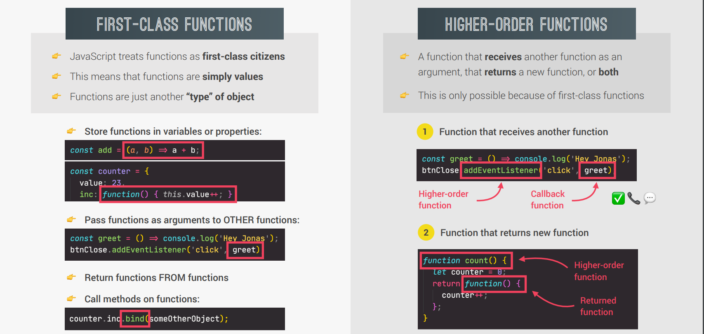

# First class function and higher order function [udemy](https://www.udemy.com/course/the-complete-javascript-course/learn/lecture/22648649#questions)



## FIRST CLASS FUNCTION

A programming language is said to have First-class functions when functions
in that language are treated like any other variable.
For example, in such a language, a function can be passed as an argument to other functions, can be returned by another function and can be assigned as a value to a variable.
JavaScript treat function as a first-class-citizens. This means that functions are simply a value and are just another type of object.

### EXAMPLE

```js
const studentFee = function (level, semester) {
  return `The Semester fee of this student is ${
    level > 2 ? 4000 : 3000
  } taka only`;
};
console.log(studentFee(3, 2));
```

we can also store the value of function in object or array

```js
const newObj = {
  name: 'Nasim reja',
  birthyear: 1997,
  age: function (year) {
    return `${this.name} born in ${this.birthyear} and Now he is ${
      year - this.birthyear
    } years old.`;
  },
};
console.log(newObj.age(2021));
```

## HIGHER ORDER FUNCTION

A function that receives another function as an argument
or that returns a new function or both is called Higher-order functions
Higher-order functions are only possible because of the First-class function.
